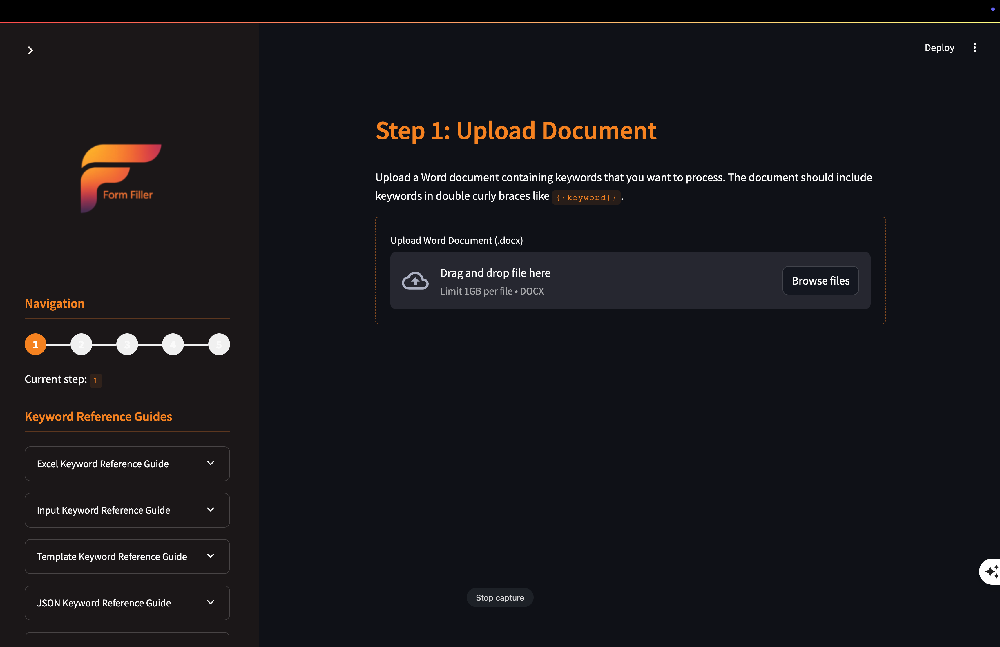

# README.md

<p align="center">
  
</p>
<p align="center">
  
</p>

# Form Filler

A comprehensive document processing system that replaces keywords in Word documents with data from Excel spreadsheets, user inputs, JSON files, and templates. This system enables dynamic document generation with data-driven content and interactive user inputs, using `!` as the primary separator within keywords.

## Core Components

### Excel Manager (`excel_manager.py`)

The `excelManager` class provides a robust interface for interacting with Excel workbooks. It handles reading and writing data, including calculated values from formulas, totals, ranges, and specific columns based on titles or references.

#### Key Methods and Examples

| Method | Description | Example |
| :----- | :---------- | :------ |
| `__init__(file_path=None)` | Initialize with optional file path | `mgr = excelManager("data.xlsx")` |
| `create_workbook(file_path=None)` | Create a new Excel workbook | `mgr.create_workbook("new.xlsx")` |
| `load_workbook(file_path=None)` | Load existing Excel workbook | `mgr.load_workbook("existing.xlsx")` |
| `save(file_path=None)` | Save workbook to disk | `mgr.save()` |
| `close()` | Close workbook | `mgr.close()` |
| `count_sheets()` | Return number of sheets | `count = mgr.count_sheets()` |
| `get_sheet_names()` | Return sheet names | `names = mgr.get_sheet_names()` |
| `create_sheet(sheet_name)` | Create a new sheet | `mgr.create_sheet("Summary")` |
| `read_cell(sheet_name, row_or_cell, column=None)` | Read cell value | `value = mgr.read_cell("Sheet1", "A1")` |
| `write_cell(sheet_name, row_or_cell, value, column=None)` | Write value to cell | `mgr.write_cell("Sheet1", "A1", "Hello")` |
| `read_range(sheet_name, start_cell_or_row, ...)` | Read range of cells | `data = mgr.read_range("Sheet1", "A1:C5")` |
| `write_range(sheet_name, start_cell_or_row, ...)` | Write values to range | `mgr.write_range("Sheet1", "A1", values)` |
| `read_total(sheet_name, row_or_cell, column=None)` | Get last value in column | `total = mgr.read_total("Sheet1", "A1")` |
| `read_items(sheet_name, row_or_cell, column=None, offset=0)` | Read consecutive values | `items = mgr.read_items("Sheet1", "A1")` |
| `read_title_total(sheet_name, row_or_cell, title, column=None)` | Find column by title, get total | `total = mgr.read_title_total("Sheet1", "A1", "Revenue")` |
| `read_columns(sheet_name, input_cells, use_titles=False, start_row=None)` | Read multiple columns | `data = mgr.read_columns("Sheet1", "A1,B1,C1")` |

The `excelManager` handles the complexity of working with Excel files:
- Maintains two versions of workbooks - one for formulas and one for calculated values
- Formats numeric values with commas and appropriate decimal places
- Intelligently traverses data to find totals and related items
- Searches for columns by title, enabling dynamic reference to data

### Keyword Parser (`keyword_parser.py`)

The `keywordParser` class processes templating keywords (enclosed in `{{}}`) within text or Word documents. It replaces keywords with values from Excel, interactive user input, JSON files, and external templates. It uses `!` as the separator between keyword components.

#### Keyword Types with Examples

##### Excel Data Keywords (`{{XL!...}}`)

Keywords to fetch data from an Excel file.

If Excel keywords `{{XL!...}}` are detected in the uploaded document, the user will be prompt to upload an Excel file in Step 2.

| Keyword Pattern | Description | Example |
| :-------------- | :---------- | :------ |
| `{{XL!CELL!cell_ref}}` | Get a value from `cell_ref` (ex: A1). | `{{XL!CELL!A1}}` → `$127,350.00` |
| `{{XL!CELL!Sheet!cell_ref}}` | Get a value from `cell_ref` (ex: A1) in `Sheet`. | `{{XL!CELL!Sales!C10}}` → `42%` |
| `{{XL!LAST!cell_ref}}` | Get the last non-empty value going down from `cell_ref` (ex: A1). Used for getting totals. | `{{XL!LAST!F5}}` → `Total: $45,982.75` |
| `{{XL!LAST!Sheet!cell_ref}}` | Get the last non-empty value going down from `cell_ref` (ex: A1) in `Sheet`. Used for getting totals. | `{{XL!LAST!Summary!B2}}` → `Grand Total: 239 units` |
| `{{XL!LAST!Sheet!cell_ref!Title}}` | From `cell_ref` (ex: A1), on `Sheet` scan right until the `Title` is detected, then get the last non-empty value going down from the `Title` column. Used for getting totals. | `{{XL!LAST!Items!A4!Total Costs}}` → `$12,540.00` |
| `{{XL!RANGE!Start Cell:End Cell}}` | Get values for the range starting at `Start Cell` (ex: A1) to the `End Cell` (ex: G13). A formatted table is returned. | `{{XL!RANGE!A5:D10}}` → *[inserts formatted table]* |
| `{{XL!RANGE!Sheet!Start Cell:End Cell}}` | Get values for the range starting at `Start Cell` (ex: A1) to the `End Cell` (ex: G13) in `Sheet`. A formatted table is returned. | `{{XL!RANGE!Expenses!B2:G10}}` → *[inserts formatted table]* |
| `{{XL!COLUMN!Sheet!Cell 1,Cell 2,Cell 3,...}}` | Returns a formatted table with columns `Cell 1` (ex: A1),`Cell 2` (ex: C1),`Cell 3` (ex: F1)... from `Sheet` appended together. Row number must be the same for each. Example: {{XL!COLUMN!Support!C4,E4,J4}}. | `{{XL!COLUMN!Items!A4,E4,F4}}` → *[inserts table with selected columns]* |
| `{{XL!COLUMN!Sheet!Title 1,Title 2,Title 3,...!Row}}` | Returns a formatted table with columns with `Title 1` (ex: Item),`Title 2` (ex: HST),`Title 3` (ex: Total)... from `Sheet` appended together. The `Title` row is specified by `Row` (ex: 6). Example: {{XL!COLUMN!Distribution Plan!Unit,DHTC,Total!4}}. | `{{XL!COLUMN!Data!"Category,Value"!1}}` → *[inserts table with matching columns]* |

##### User Input Keywords (`{{INPUT!...}}`)

Keywords to create interactive input fields in Streamlit applications.

If User Input keywords `{{INPUT!...}}` are detected in the uploaded document, the user will be prompt for input value(s) in Step 3.

| Keyword Pattern | Description | Example |
| :-------------- | :---------- | :------ |
| `{{INPUT!TEXT!label!default_value}}` | Prompt the user for a single-line text input with `label` and `default_value`. | `{{INPUT!text!Your Name!John Doe}}` |
| `{{INPUT!AREA!label!default_value!height}}` | Prompt the user for a multi-line text input with `label`, `default_value`, and `height (ex: 200)`. | `{{INPUT!area!Comments!!200}}` |
| `{{INPUT!DATE!label!default_date!format}}` | Prompt the user for a date input with `label`, `default_date` (ex: 1990/01/01), and `format` (ex: YYYY/MM/DD). | `{{INPUT!date!Select Date!today!YYYY/MM/DD}}` |
| `{{INPUT!SELECT!label!option1,option2,option3,...}}` | Prompt the user for a dropdown selection with `label` and options `option1`, `option2`, `option3`, etc. | `{{INPUT!select!Choose Color!Red,Green,Blue}}` |
| `{{INPUT!CHECK!label!default_state}}` | Prompt the user for a checkbox input with `label` and `default_state` (ex: True). | `{{INPUT!check!Agree to Terms!false}}` |

##### Template Keywords (`{{TEMPLATE!...}}`)

Keywords to include content from other files or libraries.

If Template keywords `{{TEMPLATE!...}}` are detected in the uploaded document, the application will look for the specified template file(s) `(ex: filename.docx)` in the `templates` folder.

| Keyword Pattern | Description | Example |
| :-------------- | :---------- | :------ |
| `{{TEMPLATE!filename.docx}}` | Inject the full document content. | `{{TEMPLATE!disclaimer.txt}}` |
| `{{TEMPLATE!filename.docx!section=heading}}` | Inject the content of the section named `heading` including the section heading. | `{{TEMPLATE!report.docx!section=conclusion}}` |
| `{{TEMPLATE!filename.docx!section=heading!title=false}}` | Inject the content of the section named `heading` without the section heading if title is set to false. | `{{TEMPLATE!report.docx!section=conclusion!title=false}}` |
| `{{TEMPLATE!filename.docx!section=heading_start:heading_end}}` | Inject the content of the sections from `heading_start` to `heading_end` including the section heading. | `{{TEMPLATE!report.docx!section=intro:conclusion}}` |
| `{{TEMPLATE!filename.docx!section=heading_start:heading_end&title=false}}` | Inject the content of the sections from `heading_start` to `heading_end` without the section heading if title is set to false. | `{{TEMPLATE!report.docx!section=intro:conclusion&title=false}}` |

##### JSON Data Keywords (`{{JSON!...}}`)

Keywords to fetch data from JSON files using JSONPath.

If JSON keywords `{{JSON!...}}` are detected in the uploaded document, the application will look for the specified JSON file(s) `(ex: filename.json)` in the `json` folder. The system will first look for the file at the specified path, and if not found, it will check in the 'json' directory.

| Keyword Pattern | Description | Example |
| :-------------- | :---------- | :------ |
| `{{JSON!!filename.json}}` | Inject the full JSON content. Note the double `!!` to indicate the full JSON content. | `{{JSON!!config.json}}` → *[full JSON content]* |
| `{{JSON!!filename.json!$.}}` | Alternative syntax that also injects the full JSON content (the path `$.` refers to the root). | `{{JSON!!settings.json!$.}}` → *[full JSON content]* |
| `{{JSON!filename.json!$.key}}` | Inject the content of the JSON path `key`. | `{{JSON!launch.json!$.configurations}}` → *[configurations value]* |
| `{{JSON!filename.json!$.key!SUM}}` | Sum the numeric values in the JSON path `key`. | `{{JSON!sales.json!$.monthly_totals!SUM}}` → `347890.50` |
| `{{JSON!filename.json!$.key!JOIN(, )}}` | Join the values in the JSON path `key` with a comma and space. | `{{JSON!users.json!$.names!JOIN(, )}}` → `John, Mary, Bob` |
| `{{JSON!filename.json!$.key!BOOL(Yes/No)}}` | Transform the boolean values in the JSON path `key` to custom text. | `{{JSON!status.json!$.system_active!BOOL(Online/Offline)}}` → `Online` |

##### AI Summary Keywords (`{{AI!...}}`)

Keywords to generate AI-powered summaries of document content with intelligent formatting using spaCy.

If AI keywords `{{AI!...}}` are detected in the uploaded document, the application will look for the specified document(s) in the `ai` folder or at the specified path. If the 'ai' folder does not exist, it will be created automatically.

| Keyword Pattern | Description | Example |
| :-------------- | :---------- | :------ |
| `{{AI!source-doc.docx!prompt_file.txt!words=100}}` | Summarize the entire document located at 'ai/source-doc.docx'. The summary will be limited to 100 words or less. The prompt for the summary can be found in 'ai/prompt_file.txt'. If the prompt file does not have a .txt extension, the text specified is treated as the actual prompt. | `{{AI!report.docx!Summarize this report!words=150}}` → *[150-word summary]* |
| `{{AI!source-doc.docx!prompt_file.txt!section=section header&words=100}}` | Summarize a section of the document identified by 'section header' in the document located at 'ai/source-doc.docx'. The summary will be limited to 100 words or less. | `{{AI!contract.docx!Create a summary!section=Legal Terms&words=75}}` → *[75-word summary of the section]* |
| `{{AI!source-doc.docx!prompt_file.txt!section=Attractions:Unique Experiences&words=100}}` | Summarize a range of content from 'Attractions' to 'Unique Experiences' in the document located at 'ai/source-doc.docx'. The summary will be limited to 100 words or less. | `{{AI!travel-guide.docx!concise highlights!section=History:Culture&words=100}}` → *[100-word summary of the range]* |

AI summaries are intelligently formatted with spaCy natural language processing to improve readability:
- Automatic paragraph breaks based on content structure
- Proper formatting of sentences and sections
- Recognition of bullet points and other structural elements
- Configuration options in config.json for customizing the formatting

The OpenAI API key should be stored in '.streamlit/secrets.toml' as 'openai_api_key'.

#### Word Document Integration

The parser integrates with `python-docx` for enhanced Word document processing:
- Generates well-formatted tables directly in the document from `XL!RANGE!` and `XL!COLUMN!` keywords.
- Applies styling like headers and alternating row colors to inserted tables.
- Handles nested keywords within templates and JSON paths.
- Processes entire documents, including text in tables and paragraphs.

## Main Application

The main application (`main.py`) provides a user-friendly Streamlit interface that guides users through a 5-step workflow:

1. **Document Upload**: Upload a Word document containing keywords.
2. **Analysis & File Uploads**: The system analyzes the keywords, identifies what data sources are needed, and prompts for Excel upload if necessary.
3. **User Input**: If the document contains `INPUT` keywords, the app generates a form to collect user inputs.
4. **Processing**: The keywords are processed and replaced with actual data.
5. **Download**: The processed document is available for download.

### Key Features

- **Intelligent Document Analysis**: Scans documents to detect keywords and determines required resources.
- **Interactive Forms**: Automatically generates input forms based on keywords found in the document.
- **Real-time Processing**: Shows progress while replacing keywords with dynamic content.
- **Direct Table Integration**: Creates formatted tables within Word documents when processing spreadsheet data.
- **Complete Document Processing**: Handles complex documents with multiple keyword types and nested structures.

### Usage

Start the application with:

```bash
streamlit run main.py
```

Then follow the step-by-step interface to process your documents with Form Filler.

## Tester Application

The tester application (`tester_app.py`) provides a development and testing environment for the Excel Manager and Keyword Parser components of Form Filler:

### Features

- **Excel File Operations**: Create, load and manipulate Excel files directly.
- **Sheet Management**: Create sheets, count them, and list their names.
- **Data Operations**: Read and write cells, ranges, totals, and columns.
- **Keyword Testing**: Test individual keywords and see their replacements.
- **Interactive Interface**: Test all functionality through a user-friendly Streamlit UI.

This app is particularly useful for:
- Testing Excel data access methods
- Developing and debugging new keyword types
- Validating complex keyword patterns
- Testing formatted table generation

### Usage

Start the tester app with:

```bash
streamlit run tester_app.py
```

## Setup and Installation

1. Install the required Python packages:
```bash
pip install -r requirements.txt
```

2. Set up spaCy and download the required model:
```bash
python setup.py
```

3. Configure API keys in `.streamlit/secrets.toml`:
```toml
openai_api_key = "your-api-key-here"
```

4. Start the application:
```bash
streamlit run main.py
```

## Usage Example

```python
from keyword_parser import keywordParser
from excel_manager import excelManager

# Initialize with an Excel manager
excel_mgr = excelManager("financial_report.xlsx")
parser = keywordParser(excel_mgr)

# Basic keyword replacement using FOM FILLER syntax with '!'
template = "The total revenue is {{XL!CELL!Summary!B5}}."
result = parser.parse(template)
print(result) # Example: "The total revenue is $127,350.00."

# Parse template with table from columns
report_template = """
# Financial Summary
{{XL!COLUMN!Items!"Activities,Total Project Costs"!4}}

Contact: {{INPUT!text!Contact Name:}}
"""
# In a Streamlit app, this would generate a form first
processed_report = parser.parse(report_template)

# Using AI summary with spaCy formatting
ai_template = """
# Executive Summary
{{AI!annual_report.docx!Summarize the key financial highlights in a professional tone!words=200}}
"""
# This will generate a nicely formatted summary using spaCy NLP processing
```

## Configuration

The application can be configured through `config.json`. Key configuration options include:

```json
{
  "llm": {
    "provider": "openai",
    "use_triton": false,
    "settings": {
      "openai": {
        "model": "gpt-4o",
        "temperature": 0.5
      }
    }
  },
  "spacy": {
    "enabled": true,
    "model": "en_core_web_sm",
    "format_entities": true,
    "paragraph_breaks": true,
    "entity_styles": {
      "PERSON": {"bold": true},
      "ORG": {"bold": true, "underline": true},
      "DATE": {"italic": true},
      "MONEY": {"bold": true}
    }
  },
  "paths": {
    "templates": "templates",
    "json": "json",
    "ai": "ai"
  }
}
```

## Developer

**David Seguin** is the creator and lead developer of FORM Filler.