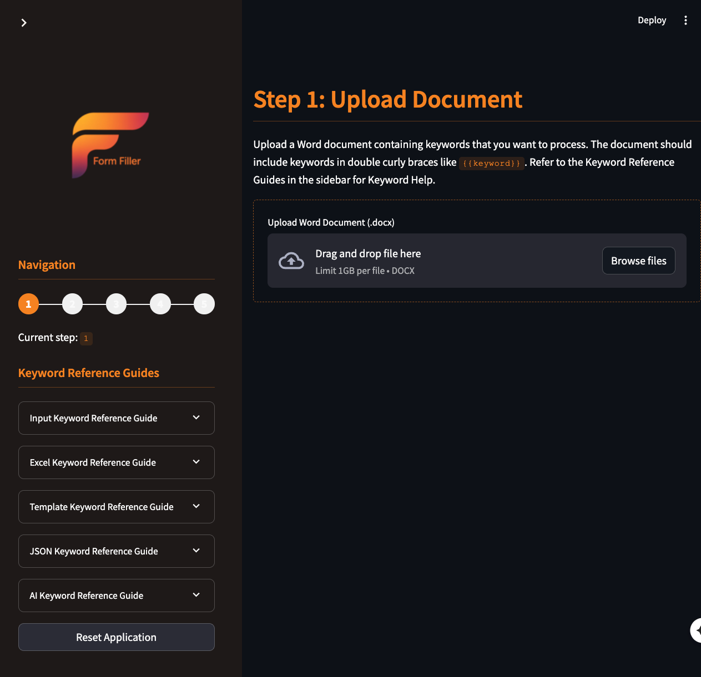

# README.md

<p align="center">
  
    
</p>


# Form Filler

A comprehensive document processing system that replaces keywords in Word documents with data from Excel spreadsheets, user inputs, JSON files, and templates. This system enables dynamic document generation with data-driven content and interactive user inputs, using `!` as the primary separator within keywords.

## Core Components

### Excel Manager (`excel_manager.py`)

The `excelManager` class provides a robust interface for interacting with Excel workbooks. It handles reading and writing data, including calculated values from formulas, totals, ranges, and specific columns based on titles or references.

#### Key Methods and Examples

| Method | Description | Example |
| :----- | :---------- | :------ |
| `__init__(file_path=None)` | Initialize with optional file path | `mgr = excelManager("data.xlsx")` |
| `create_workbook(file_path=None)` | Create a new Excel workbook | `mgr.create_workbook("new.xlsx")` |
| `load_workbook(file_path=None)` | Load existing Excel workbook | `mgr.load_workbook("existing.xlsx")` |
| `save(file_path=None)` | Save workbook to disk | `mgr.save()` |
| `close()` | Close workbook | `mgr.close()` |
| `count_sheets()` | Return number of sheets | `count = mgr.count_sheets()` |
| `get_sheet_names()` | Return sheet names | `names = mgr.get_sheet_names()` |
| `create_sheet(sheet_name)` | Create a new sheet | `mgr.create_sheet("Summary")` |
| `read_cell(sheet_name, row_or_cell, column=None)` | Read cell value | `value = mgr.read_cell("Sheet1", "A1")` |
| `write_cell(sheet_name, row_or_cell, value, column=None)` | Write value to cell | `mgr.write_cell("Sheet1", "A1", "Hello")` |
| `read_range(sheet_name, start_cell_or_row, ...)` | Read range of cells | `data = mgr.read_range("Sheet1", "A1:C5")` |
| `write_range(sheet_name, start_cell_or_row, ...)` | Write values to range | `mgr.write_range("Sheet1", "A1", values)` |
| `read_total(sheet_name, row_or_cell, column=None)` | Get last value in column | `total = mgr.read_total("Sheet1", "A1")` |
| `read_items(sheet_name, row_or_cell, column=None, offset=0)` | Read consecutive values | `items = mgr.read_items("Sheet1", "A1")` |
| `read_title_total(sheet_name, row_or_cell, title, column=None)` | Find column by title, get total | `total = mgr.read_title_total("Sheet1", "A1", "Revenue")` |
| `read_columns(sheet_name, input_cells, use_titles=False, start_row=None)` | Read multiple columns | `data = mgr.read_columns("Sheet1", "A1,B1,C1")` |

The `excelManager` handles the complexity of working with Excel files:
- Maintains two versions of workbooks - one for formulas and one for calculated values
- Formats numeric values with commas and appropriate decimal places
- Intelligently traverses data to find totals and related items
- Searches for columns by title, enabling dynamic reference to data

### Keyword Parser (`keyword_parser.py`)

The `keywordParser` class processes templating keywords (enclosed in `{{}}`) within text or Word documents. It replaces keywords with values from Excel, interactive user input, JSON files, and external templates. It uses `!` as the separator between keyword components.

#### Keyword Types with Examples

##### Excel Data Keywords (`{{XL!...}}`)

Keywords to fetch data from an Excel file.

| Keyword Pattern                                       | Description                                                                                     | Example                                                       |
| :---------------------------------------------------- | :---------------------------------------------------------------------------------------------- | :------------------------------------------------------------ |
| `{{XL!CELL!cell_ref}}`                                | Get value from a single cell (e.g., `A1`).                                                      | `{{XL!CELL!A1}}` → `$127,350.00`                              |
| `{{XL!CELL!SheetName!cell_ref}}`                      | Get value from a cell on a specific sheet.                                                      | `{{XL!CELL!Sales!C10}}` → `42%`                               |
| `{{XL!LAST!cell_ref}}`                                | Get the last non-empty value going down from `cell_ref`.                                        | `{{XL!LAST!F5}}` → `Total: $45,982.75`                        |
| `{{XL!LAST!SheetName!cell_ref}}`                      | Get the last non-empty value from a specific sheet.                                             | `{{XL!LAST!Summary!B2}}` → `Grand Total: 239 units`           |
| `{{XL!LAST!sheet_name!cell_ref!Title}}`               | Find column by `Title` in `cell_ref`'s row, get last value below.                               | `{{XL!LAST!Items!A4!Total Costs}}` → `$12,540.00`             |
| `{{XL!RANGE!range_ref}}`                              | Get values from a range (e.g., `A1:C5` or `NamedRange`). Returns formatted table.               | `{{XL!RANGE!A5:D10}}` → *[inserts formatted table]*           |
| `{{XL!RANGE!SheetName!range_ref}}`                    | Get values from a range on a specific sheet.                                                    | `{{XL!RANGE!Expenses!B2:G10}}` → *[inserts formatted table]*  |
| `{{XL!COLUMN!sheet_name!col_refs}}`                   | Get specified columns by cell reference (e.g., "A1,C1,E1"). Returns table.                      | `{{XL!COLUMN!Items!A4,E4,F4}}` → *[inserts table with selected columns]* |
| `{{XL!COLUMN!sheet_name!"Titles"!start_row}}`         | Get columns by `Titles` (e.g., "Revenue,Profit") found in `start_row`. Returns table.           | `{{XL!COLUMN!Data!"Category,Value"!1}}` → *[inserts table with matching columns]* |

##### User Input Keywords (`{{INPUT!...}}`)

Keywords to create interactive input fields in Streamlit applications.

| Keyword Pattern                         | Description                                                   | Example                                                |
| :-------------------------------------- | :------------------------------------------------------------ | :----------------------------------------------------- |
| `{{INPUT!text!label!default_value}}`    | Single-line text input.                                       | `{{INPUT!text!Your Name!John Doe}}`                    |
| `{{INPUT!area!label!default_value!height}}` | Multi-line text area (optional height).                       | `{{INPUT!area!Comments!!200}}`                         |
| `{{INPUT!date!label!default_date!format}}` | Date picker ('today' or 'YYYY/MM/DD', optional format).       | `{{INPUT!date!Select Date!today!YYYY/MM/DD}}`          |
| `{{INPUT!select!label!opt1,opt2,...}}`  | Dropdown selection.                                           | `{{INPUT!select!Choose Color!Red,Green,Blue}}`         |
| `{{INPUT!check!label!default_state}}`   | Checkbox ('True' or 'False').                                 | `{{INPUT!check!Agree to Terms!false}}`                 |

##### Template Keywords (`{{TEMPLATE!...}}`)

Keywords to include content from other files or libraries.

| Keyword Pattern                                    | Description                                                               | Example                                                     |
| :------------------------------------------------- | :------------------------------------------------------------------------ | :---------------------------------------------------------- |
| `{{TEMPLATE!filename.docx}}`                       | Include entire external template file.                                    | `{{TEMPLATE!disclaimer.txt}}`                               |
| `{{TEMPLATE!filename.docx!section=name}}`          | Include specific section/bookmark (implementation specific).              | `{{TEMPLATE!report.docx!section=conclusion}}`               |
| `{{TEMPLATE!filename.txt!line=5}}`                 | Include specific line number from text file.                              | `{{TEMPLATE!data.txt!line=10}}`                             |
| `{{TEMPLATE!filename.docx!paragraph=3}}`           | Include specific paragraph number (based on "\n\n" separation).           | `{{TEMPLATE!letter.txt!paragraph=2}}`                       |
| `{{TEMPLATE!filename.docx!VARS(key=val,...}})`     | Template with variable substitution (values can be keywords).             | `{{TEMPLATE!invite.txt!VARS(name=Jane,event=Party)}}`       |
| `{{TEMPLATE!LIBRARY!template_name!version}}`       | Reference template from a predefined library (optional version).          | `{{TEMPLATE!LIBRARY!confidentiality_clause}}`               |

##### JSON Data Keywords (`{{JSON!...}}`)

Keywords to fetch data from JSON files using JSONPath.

| Keyword Pattern                                    | Description                                                               | Example                                                       |
| :------------------------------------------------- | :------------------------------------------------------------------------ | :------------------------------------------------------------ |
| `{{JSON!filename.json!json_path}}`                 | Access data using JSONPath (e.g., `$.key`, `$.array[0].name`).            | `{{JSON!config.json!$.settings.theme}}` → `dark`               |
| `{{JSON!filename.json!json_path!TRANSFORMATION}}`  | Apply optional transformation: `SUM`, `JOIN(delimiter)`, `BOOL(Yes/No)`.  | `{{JSON!sales.json!$.quarterly!SUM}}` → `347890.50`           |
|                                                    |                                                                           | `{{JSON!users.json!$.names!JOIN(, )}}` → `John, Mary, Bob`     |
|                                                    |                                                                           | `{{JSON!settings.json!$.active!BOOL(Enabled/Disabled)}}` → `Enabled` |

#### Word Document Integration

The parser integrates with `python-docx` for enhanced Word document processing:
- Generates well-formatted tables directly in the document from `XL!RANGE!` and `XL!COLUMN!` keywords.
- Applies styling like headers and alternating row colors to inserted tables.
- Handles nested keywords within templates and JSON paths.
- Processes entire documents, including text in tables and paragraphs.

## Main Application

The main application (`main.py`) provides a user-friendly Streamlit interface that guides users through a 5-step workflow:

1. **Document Upload**: Upload a Word document containing keywords.
2. **Analysis & File Uploads**: The system analyzes the keywords, identifies what data sources are needed, and prompts for Excel upload if necessary.
3. **User Input**: If the document contains `INPUT` keywords, the app generates a form to collect user inputs.
4. **Processing**: The keywords are processed and replaced with actual data.
5. **Download**: The processed document is available for download.

### Key Features

- **Intelligent Document Analysis**: Scans documents to detect keywords and determines required resources.
- **Interactive Forms**: Automatically generates input forms based on keywords found in the document.
- **Real-time Processing**: Shows progress while replacing keywords with dynamic content.
- **Direct Table Integration**: Creates formatted tables within Word documents when processing spreadsheet data.
- **Complete Document Processing**: Handles complex documents with multiple keyword types and nested structures.

### Usage

Start the application with:

```bash
streamlit run main.py
```

Then follow the step-by-step interface to process your documents with Form Filler.

## Tester Application

The tester application (`tester_app.py`) provides a development and testing environment for the Excel Manager and Keyword Parser components of Form Filler:

### Features

- **Excel File Operations**: Create, load and manipulate Excel files directly.
- **Sheet Management**: Create sheets, count them, and list their names.
- **Data Operations**: Read and write cells, ranges, totals, and columns.
- **Keyword Testing**: Test individual keywords and see their replacements.
- **Interactive Interface**: Test all functionality through a user-friendly Streamlit UI.

This app is particularly useful for:
- Testing Excel data access methods
- Developing and debugging new keyword types
- Validating complex keyword patterns
- Testing formatted table generation

### Usage

Start the tester app with:

```bash
streamlit run tester_app.py
```

## Usage Example

```python
from keyword_parser import keywordParser
from excel_manager import excelManager

# Initialize with an Excel manager
excel_mgr = excelManager("financial_report.xlsx")
parser = keywordParser(excel_mgr)

# Basic keyword replacement using FOM FILLER syntax with '!'
template = "The total revenue is {{XL!CELL!Summary!B5}}."
result = parser.parse(template)
print(result) # Example: "The total revenue is $127,350.00."

# Parse template with table from columns
report_template = """
# Financial Summary
{{XL!COLUMN!Items!"Activities,Total Project Costs"!4}}

Contact: {{INPUT!text!Contact Name:}}
"""
# In a Streamlit app, this would generate a form first
processed_report = parser.parse(report_template)
```

## Developer

**David Seguin** is the creator and lead developer of FORM Filler. 